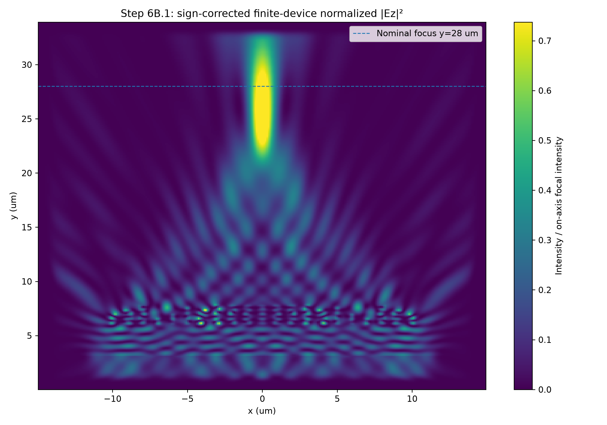
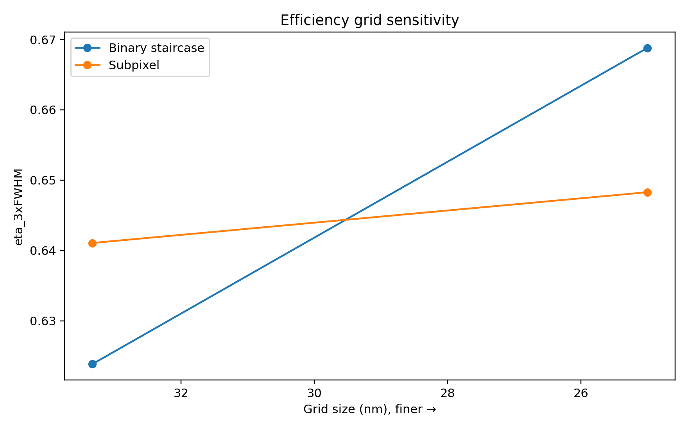
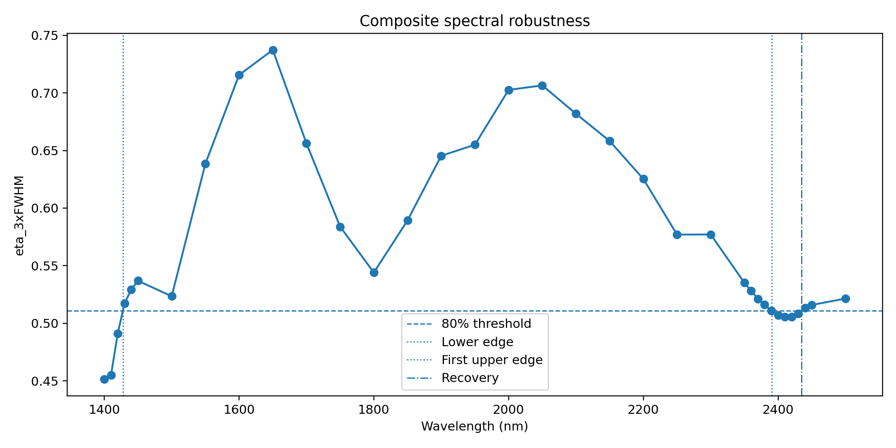

# C++ FDTD Metalens Simulation

A from-scratch **2D TMz finite-difference time-domain (FDTD)** project for
discrete metalens design and numerical validation.

The project develops a Yee-grid solver in C++, verifies a discrete phase
library, assembles a finite 21-cell metalens, introduces subpixel dielectric
averaging, and evaluates focusing efficiency and broadband spectral robustness.

# C++ FDTD Metalens Simulation

A from-scratch **2D TMz finite-difference time-domain (FDTD)** framework for
discrete metalens design, numerical validation, focusing analysis, and
broadband spectral characterization.

## Metalens focusing

<p align="center">
  
</p>

*Normalized electric-field intensity |Ez|² from the finite-device simulation,
showing the formation of the focal region after the phase-sign correction.*

## Key Results

| Metric | Result |
|---|---:|
| Design wavelength | **1550 nm** |
| Metalens cells | **21** |
| Aperture diameter | **20 µm** |
| Target focal distance | **20 µm** |
| Simulated focus position | **25.62 µm** |
| Lateral FWHM | **1.38 µm** |
| Post-lens transmission | **81.32%** |
| 3×FWHM focusing efficiency | **64.83%** |
| 3×FWHM focal capture | **87.49%** |
| Subpixel grid sensitivity in efficiency | **1.11%** |
| Continuous 80%-retention spectral interval* | **1.43–2.39 µm** |

\*Spectral bandwidth is reported for the current idealized 2D TMz, lossless,
nondispersive \(n = 2\) model and is not a prediction of a fabricated 3D device.

## Highlight

- C++17 Yee-FDTD implementation
- 2D TMz electromagnetic propagation
- CPML absorbing boundaries
- Periodic and open-boundary simulations
- Complex Fourier/DFT field monitors
- Spatially integrated Poynting-flux normalization
- OpenMP parallelization
- Subpixel dielectric-interface averaging
- Verified 8-state transmission-phase library
- Finite 21-cell metalens simulation
- Grid-stabilization studies
- Broadband multi-frequency analysis

## Final 1550-nm result

Preferred result from the **25-nm subpixel full-device model**:

| Metric | Result |
|---|---:|
| Design wavelength | 1550 nm |
| Metalens cells | 21 |
| Nominal aperture diameter | 20 µm |
| Target focal distance | 20 µm |
| Simulated focus position | 25.6177 µm |
| Nominal focus coordinate | 28.0 µm |
| Focal shift | -2.3823 µm |
| Lateral FWHM | 1.3752 µm |
| Post-lens transmission | 81.32% |
| 3×FWHM focusing efficiency | **64.83%** |
| 3×FWHM focal capture | 87.49% |

The 33.333→25 nm subpixel change is **1.11%** in focusing efficiency and
**0.27%** in post-lens transmission.



## Verified 8-state phase library

| Target phase | Geometry (width × height) nm | Verified phase | Transmission |
|---:|---:|---:|---:|
| 0° | 600.00 × 1800.00 | 7.654° | 0.9234 |
| 45° | 450.00 × 1833.33 | 44.568° | 0.9983 |
| 90° | 666.67 × 1333.33 | 87.311° | 0.9402 |
| 135° | 300.00 × 1600.00 | 140.156° | 0.9750 |
| 180° | 500.00 × 1000.00 | 174.155° | 0.9092 |
| 225° | 300.00 × 1000.00 | 224.540° | 0.9770 |
| 270° | 300.00 × 616.67 | 271.134° | 0.9814 |
| 315° | 183.33 × 533.33 | 313.983° | 0.9604 |

## Broadband response

Within the current idealized nondispersive model, the continuous
80%-efficiency-retention band connected to the 1550-nm design point is:

**1427.50–2390.51 nm**

corresponding to a continuous numerical bandwidth of approximately
**963.01 nm**.

A narrow below-threshold region occurs afterward, with recovery near
**2434.56 nm**.



This spectral result is a property of the idealized model and should **not** be
interpreted as the bandwidth of a fabricated real-material metalens.

## Repository structure

```text
cpp-fdtd-metalens/
├── src/
│   ├── unit_cell_library_verification.cpp
│   ├── full_device_subpixel_33nm.cpp
│   ├── full_device_subpixel_25nm.cpp
│   └── spectral_band_localization.cpp
├── analysis/
│   ├── plot_unit_cell_library.py
│   ├── plot_efficiency_convergence.py
│   ├── plot_spectral_band.py
│   └── make_final_figures.py
├── data/
│   ├── final_verified_8state_library.csv
│   ├── final_metrics.csv
│   ├── composite_spectrum.csv
│   ├── full_device_convergence.csv
│   └── efficiency_convergence.csv
├── figures/
├── docs/
│   ├── FINAL_RESULTS.md
│   └── PORTFOLIO_SUMMARY.md
├── CMakeLists.txt
└── requirements.txt
```

## Build

Requirements:

- GCC/Clang with C++17
- OpenMP recommended
- CMake 3.16+ optional
- Python with NumPy, pandas, and Matplotlib for post-processing

### Direct GCC build

Example on MSYS2 UCRT64 / Windows:

```powershell
g++ src/full_device_subpixel_25nm.cpp -std=c++17 -O2 -fopenmp -o metalens_25nm.exe
```

Run from the repository root:

```powershell
.\metalens_25nm.exe
```

### CMake

```bash
cmake -S . -B build
cmake --build build --config Release
```

## Python post-processing

Install the plotting dependencies:

```bash
pip install -r requirements.txt
```

The simulation programs write generated output into `plots/`.
The corresponding analysis scripts can then be run from the repository root.

## Numerical scope and limitations

This repository is a **numerical portfolio project**, not a fabricated-device
prediction. The current model assumes:

- 2D TMz propagation
- per-unit out-of-plane length
- lossless, nondispersive pillar refractive index `n = 2`
- no substrate
- no material absorption
- no fabrication roughness or dimensional tolerance
- no full 3D polarization/coupling study

Accordingly, the reported efficiency and broad spectral interval should be
described as results **within this idealized 2D FDTD model**.

## Project evolution

The development progressed through:

1. 1D Yee-FDTD validation
2. dielectric-interface Fresnel validation
3. finite-slab Fabry–Pérot validation
4. Bragg-mirror validation against transfer-matrix results
5. 2D periodic unit-cell phase-library construction and repair
6. finite-device metalens assembly
7. focal-position and grid stabilization
8. incident-power-normalized focusing efficiency
9. subpixel geometry convergence
10. broadband spectral robustness and band-edge localization

Detailed final numerical results are in
[`docs/FINAL_RESULTS.md`](docs/FINAL_RESULTS.md).

## Author

**Forouzan Habibi**

Computational photonics / optical simulation portfolio project.
